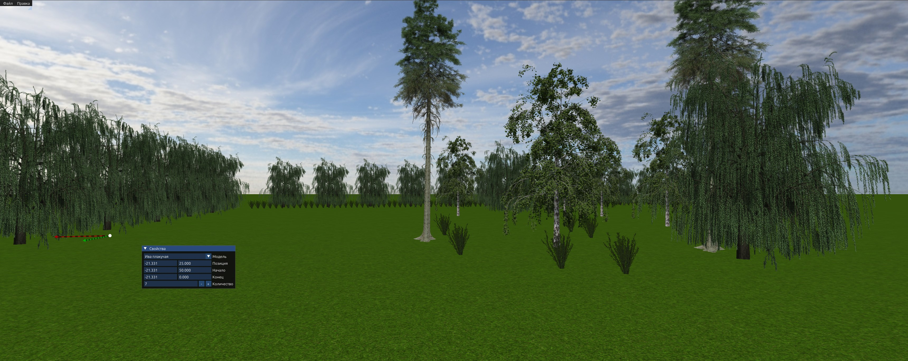

# RpModeling
Программа по моделированию поместья.

## Основные преимущества
- Простота, удобство — не надо осваивать сложные интерфейсы.
- Наличие готовых растений.
- Скорость, качество — оптимизированный, аккуратный, проверенный код.
- Бесплатно — максимально разрешительные лицензии (MIT / CC0 / Public domain).

## Возможности
- Добавлять/удалять растения и линии растений.
- Перемещать растения мышкой, или задавать точную позицию (в метрах).
- Сохранять/загружать проект. При этом, XML формат позволяет читать и править вручную (при необходимости).
- Можно добавлять новые растения (изображение с прозрачным фоном, задавать имя, высоту).
- Управление камерой:
    w, a, s, d — движение камеры;
    стрелки/мышь — вращение камеры;
    Page Up/Page Down — движение камеры вверх/вниз;
    Shift — ускорение перемещения;
    Scroll Lock — переключение мыши на управление камерой (спрятать курсор), или интерфейсом (показать курсор).

Пример проекта есть в папке Demo.

Группа VK: https://vk.com/club237368392

## Зависимости от библиотек
| Библиотека    | Версия  | Лицензия                            | Связывание | Описание |
| ------------- | ------- | ----------------------------------- | ---------- | -------- |
| GEng			| 		  | public domain                       | встроена   | 3d движок. |

## Используемые инструменты
| Программа  | Версия  | Лицензия                                 | Описание    |
| ---------- | ------- | ---------------------------------------- | ----------- |
| VSCodium   | 1.101   | MIT                                      | Ide. С плагином clangd - для подсветки ошибок, и навигации по коду. |
| Clang      | 18      | Apache License v2.0 with LLVM Exceptions | Компилятор C, С++ (открытый, качественный). |
| SCons      | 4.5.2   | MIT                                      | Система сборки (простая, мульти-платформенная). |

## Сборка
Инструкции в файле Doc/Build.txt.

## License
Программа находится в общественном достоянии (public domain).